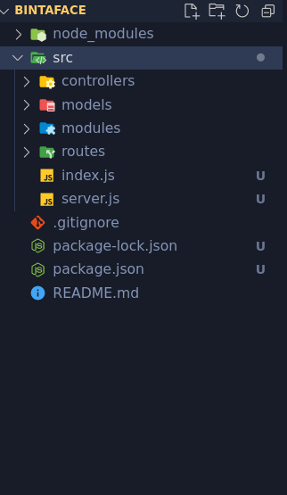

# Steps to Building an API

---

A Camariana - MDI'a National Diploma in Computer Science

Once you identify your project name and have your schema in place, follow the followings steps to get up and running with your project.

## Step 1

Go to github.com and create a new repository. 

- The name of the repository should be the name of your project.
- add a description if you want
- add a README
- add a .gitignore but choose **node**

For me, my project name is **bintaface**

Once, you create the repository clone it to your local computer.

Next, open the project with VS Code

## Step 2

Once you open the project, if all is good, you should see the following two files

- .gitignore
- README.md

Nice progress, let's move on.

Within VS Code go to Terminal on the menu on top and click on New Terminal

Within the terminal type the following to initialise the project

```shell
npm init -y
```

Note: this will automatically create a package.json file


## Step 3

Now  lets install the packages we need to for our API. Here's is a list of packages we need for now

- express
- mongoose
- nodemon

```shell
npm install express mongoose
```

and we install nodemon as dev dependency

```shell
npm install --save-dev nodemon
```

Note: You need to be connected to the internet for this work

You also need to make sure you have installed mongoDB locally in your system.

## Step 4

Project struture,

Within the root of the project, create a folder called **src**

Inside the /src folder create the following folders:

- routes
- controllers
- models
- modules or utilities (the same idea, stick to one)

Inside the /src folder create the following files:

- index.js
- server.js

Here's is an example of how you project should look like for now.



## Step 5

The initial server code for our express API

Within the **server.js** do the following code

```js
const express = require('express');
const app = express();


app.use(express.json());
app.use(express.urlencoded({ extended: true }));


app.get('/', (req, res) => {
  res.status(200).json({ message: 'Peace' });
});


module.exports = app;
```

And within the **index.js** do the following code

```js
const app = require('./server');

const PORT = 3001;

app.listen(PORT, () => {
	console.log(`Rest API listening on port ${PORT}`);
});
```

So alot is happening here with few lines of code, thanks to the power of express.

Everything will be explain soon

Let’s update our **package.json** to include the following start script in the "scripts" section:

The script section looks like this

```json
"scripts": {
	"test": "echo \"Error: no test specified\" && exit 1"
},
```

Now change it to this

```json
"scripts": {
   "start": "node src/index.js",
   "dev": "nodemon src/index.js"
},
```

We can check to see if things are working as expected by running our newly created start script.

Within the terminal in VS Code, run the following command

```shell
npm run dev
```

You should see nodemon doing its thing and

a message saying  Rest API listening on port 3001

In your browser, if you go to the address, http://localhost:3001/ you should see

```json
{
  "message": "Peace"
}
```

Congrats, you have build a simple API.


## Step 6

Connecting to our database

Before we actually connect to our database, let's create a connection module to use to connect to our database.

Within the **/modules** folder, create a file called **connect.js** and do the following code

```js
const mongoose = require('mongoose');

const URI = 'mongodb://localhost:27017/bintaface';

const connect = () => {
	return mongoose.connect(URI, {
		useNewUrlParser: true,
		useUnifiedTopology: true,
		autoIndex: false,
	})
};

module.exports = connect;
```

**Note: Don't forget to update the database name at the end of the URI to your own database name**

this line

```js
const URI = 'mongodb://localhost:27017/bintaface';
```

Next up let's require our connect module in the **server.js** file and connect to our database

Here's the code to that,

First we require the connect module like this:

```js
const connect = require('./modules/connect');
```

And here is the connection function to include in the **server.js** after requiring it

```js
// Connect to Database
void (async () => {
  try {
    await connect();
    console.log('connected to database');
  } catch (error) {
    console.log('error connecting to database:', error.message);
  }
})();
```

This will automatically create your database in mongoDB, you can use compass to make sure the database is created by simply looking at the list of databases.

Here's the rest of the updated **server.js** file

```js
const express = require('express');
const app = express();

const connect = require('./modules/connect');


app.use(express.json());
app.use(express.urlencoded({ extended: true }));


// Connect to Database
void (async () => {
  try {
    await connect();
    console.log('connected to database');
  } catch (error) {
    console.log('error connecting to database:', error.message);
  }
})();


app.get('/', (req, res) => {
  res.status(200).json({ message: 'Peace' });
});


module.exports = app;
```

Nice progress, if you get here.

## Step 7

Translating our schemas into models

This process is the same for all your models, the difference will be the name of the model/entity and it's attributes

1. **The model**

Let's start with the user model

Inside the **/models** folder, create a file called **user.js** and do the followig code

```js
const mongoose = require('mongoose')

const userSchema = new mongoose.Schema(
  {
    email: {
      type: String,
      required: true,
      unique: true,
      trim: true
    },
    password: {
      type: String,
      required: true
    },
    firstname: {
      type: String,
      trim: true,
      maxlength: 25
    },
    minit: {
      type: String,
      trim: true,
      maxlength: 25
    },
    lastname: {
      type: String,
      trim: true,
      maxlength: 25
    },
    role: {
      type: String,
      enum: ['Admin', 'User'], 
      default: 'User'
    }
  },
  { timestamps: true }
)


userSchema.set('toJSON', {
  transform: (document, returnedObject) => {
    returnedObject.id = returnedObject._id.toString()
    delete returnedObject._id
    delete returnedObject.__v
    // the password should not be revealed
    delete returnedObject.password
  }
})


const User  = mongoose.model('user', userSchema)

module.exports = User
```

2. **The controller**

Once we create the user model and export the model, we can happily require the model in our controller and create a new user.

Inside the **/controllers** folder, create a file called **user.js** and do the followig code

```js
const User = require('../models/user');

const createUser = async (req, res) => {
  const content = req.body;

  console.log(content);
  try {
    const user = await User.create({ ...content });

    return res.status(201).json({ data: user });
  } catch (error) {
    console.log(error);
    return res.status(500).end();
  }
};


module.exports = {
  createUser
};
```

3. **The router**

Then we can create a new file called **router.js** inside the **/routes** to handle all of routes of the entire application. But for now will do only the user router.

So, within the **router.js** file

 let's do the following code

```js
const express = require('express');
const router = express.Router();

const { createUser } = require('../controllers/user');


// User route
router.post('/user', createUser);


module.exports = router;
```

Finally and finally, we can add our routes to the **server.js** for routing our users to the various endpoints. 

Let’s update our **server.js** to include our route and put it to use.

First we are going to require the routes like this:

```js
const routes = require('./routes/router');
```

then we can put it to use like this:

```js
app.use('/api', routes);
```

Here is the updated **server.js** file with the above code included

```js
const express = require('express');
const app = express();

const connect = require('./modules/connect');
const routes = require('./routes/router');


app.use(express.json());
app.use(express.urlencoded({ extended: true }));


// Connect to Database
void (async () => {
  try {
    await connect();
    console.log('connected to database');
  } catch (error) {
    console.log('error connecting to database:', error.message);
  }
})();


app.get('/', (req, res) => {
  res.status(200).json({ message: 'Peace' });
});


app.use('/api', routes);


module.exports = app;
```

## Step 8

Let's test to see, if wee would be able to create a new user using the VS CODE rest client

Within the **root folder** of the project creates a new folder called **requests**

Inside requests create a file called **create-one.rest**

In that file, let's send a POST request to create a new user, see the code below for that.

```json
POST http://localhost:3001/api/user HTTP/1.1
content-type: application/json 

{
  "email": "ac@camariana.gm",
  "password": "secret",
  "firstname": "A",
  "minit": "",
  "lastname": "Camariana"
}
```

Take note of line 1

```json
POST http://localhost:3001/api/user HTTP/1.1
```

if you lcarefuly study the HTTP protocol, you will notice the following

- 3001 - that's the port
- /api/user - that our user enpoint

Within the VS CODE rest client, you will see on top of line 1 **Send Request**, click it. 

If all goes well you should see a response like this:

```json
HTTP/1.1 201 Created
X-Powered-By: Express
Content-Type: application/json; charset=utf-8
Content-Length: 210
ETag: W/"d2-/I0yK/fE80rXZdmXASBEqN4fWZs"
Date: Sat, 15 Oct 2022 07:06:03 GMT
Connection: close

{
  "data": {
    "email": "ac@camariana.gm",
    "firstname": "A",
    "minit": "",
    "lastname": "Camariana",
    "role": "User",
    "createdAt": "2022-10-15T07:06:03.201Z",
    "updatedAt": "2022-10-15T07:06:03.201Z",
    "id": "634a5bdb441c0826a1b5e678"
  }
}
```

This is good, this means, we have successfully created one user.

Please add another different 2 - 5 users by updating the content of the POST request in the create-one.rest file and send a request.

## Step 9

